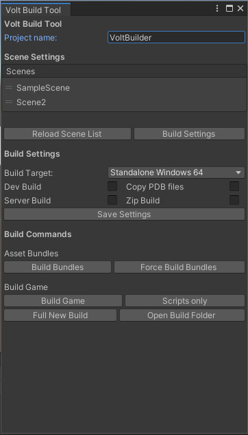

# UnityVoltBuilderTool

[](https://github.com/Voltstro/UnityVoltBuilderTool/actions)
[](/LICENSE)
[](https://discord.voltstro.dev) 
[](https://www.youtube.com/Voltstro)


An in editor, modular tool to make Unity game builds easier and more convenient.

# Features

The main feature of this tool is that its modular! It is broken down into 3 sections, scene settings, build settings and game builder.
You can modify or provide your own modules for any of these sections using the interfaces.

The default modules provide these features:
* Scene import from build settings, re-arrange in tool
* Change build target, if it’s a dev build, copy PDB files and/or if it’s a server build
* Copy files to build folder on successful build
* Zip build folder on successful build
* Build bundles
* Build game as full or scripts only
* Do a new build in a new folder with the current date

# Installation

Please read all of the install instructions before installing!

## Dependencies

- This tool does require Newtonsoft.Json to be in your project, and by default uses the [Unity package version](https://docs.unity3d.com/Packages/com.unity.nuget.newtonsoft-json@2.0/manual/index.html) of it. If you already have Newtonsoft.Json installed as a plugin you will need to remove it and use the package version.

- By default, VoltBuilder has .zip support for the builds, so it includes `System.IO.Compression` and `System.IO.Compression.FileSystem` as plugins in the package. If you have these in your project you may need to remove them.

## Installing the package

There are two ways to install this, you can either install it via the package manager (recommended way) or the old school way via the [releases](/releases) section.

To install it via the package manager you will need to:

1. Open up the package manager via Windows **->** Package Manager
2. Click on the little + sign **->** Add package from git URL...
3. Type `https://github.com/VoltUnityPackages/UnityVoltBuilderTool.git?path=/src/VoltBuilder/Assets/Editor/VoltBuild` and add it
4. Unity will now download and install the package

# Using the tool

To use the tool, go to Tools **->** Volt Build **->** Build Tool. It will open up a screen that looks like this: (default)



Its recommended to dock the window somewhere for convince.

If you are using the default build config and default builder, you can change what files are copied to the build folder by going to Tools **->** Volt Build **->** Copy Files On Build Editor.

## Supported Versions

This tool was built and tested for Unity 2019.4 on Windows. 

Other OSes should work; however, no testing has been done on them. The only thing that will not work on other Oses is the 'Open Build Folder' button

## Modifying the tool for your project

This tool is designed to be modified, you can still use the default one if you want!

Like I said before, the build tool is broken down into 3 sections using interfaces. You can change what class that implements the interface required. An example is included on how to do that in the package. You can import the sample by going to the package in the package manager, and importing the sample under the 'Samples' section.

## Using a custom config

You may want to use a custom build config to save settings that you need in your build settings. For example, you might want to save if you want to copy the build or not.

You can change it via change the variable `ConfigManager.Config` to a class that implements `Config`.

After that you can use `ConfigManager.GetBuildConfig(out T config)` to get a custom build config. E.G:

```csharp
if(ConfigManager.GetBuildConfig(out MyExampleConfig config))
{
	config.CopyBuildToShare = true;
}
```

# Authors
Voltstro – *Initial Work* – [Voltstro](https://github.com/Voltstro)

# License
This project is licensed under the Apache-2.0 license – see the [LICENSE](/LICENSE) file for details.
