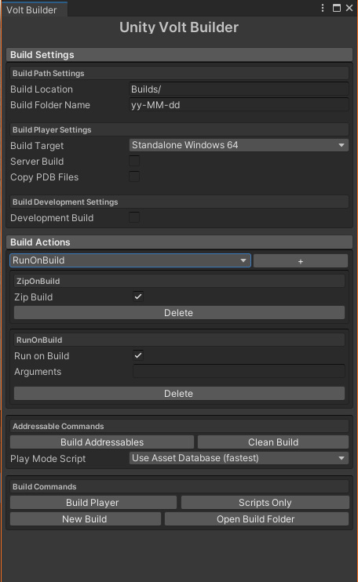

# Unity Volt Builder

[](/LICENSE.md)
[](https://discord.voltstro.dev) 
[](https://www.youtube.com/Voltstro)

Voltstro-Studios' Unity build tool, with a modular scripting design.

# Features

- Easy to get at menu of settings to build your Unity player.
- Build Actions (Can add custom GUI to the tool, do something before and after a build)
	- Three are provided, CopyFilesOnBuild, RunOnBuild and [ZipOnBuild](#ZipOnBuild)
- Easily do a "Quick" build, a new build, or a scripts only build.
- Easily add additional commands to the main window
- [Addressables](#addressables) commands

# Installation

Please read all of the install instructions before installing!

## Installing the package

To install it via the package manager you will need to:

1. Open up the package manager via Windows **->** Package Manager
2. Click on the little + sign **->** Add package from git URL...
3. Type `https://github.com/Voltstro-Studios/UnityVoltBuilder.git` and add it
4. Unity will now download and install the package

# Using the tool

To use the tool, go to Tools **->** Unity Volt Builder **->** Volt Builder. It will open up a screen that looks like this:



(Note: This is the window when [Addressables](#addressables) are installed)

It is recommended to dock the window somewhere for convince.

## Build Actions

You can add build actions under the 'Build Actions' menu, the select what build action you want to add by selecting it in the dropdown, then press the '+' button.

### ZipOnBuild

This build action requires the [`com.unity.sharp-zip-lib`](https://docs.unity3d.com/Packages/com.unity.sharp-zip-lib@latest/) package to be installed. By default, the package DOES NOT appear under the Unity Registry menu in the package manager, you will need to add it manually by either altering your `manifest.json` file, or by typing `com.unity.sharp-zip-lib` into the Add package from git URL option in the package manager.

### Custom Build Actions

To add a custom Build Action, add a class to your project, and make it implement `IBuildAction`. You will then need to add the required methods: `OnGUI()`, `OnBeforeBuild(string buildLocation, BuildTarget buildTarget, ref BuildOptions buildOptions)`, and `OnAfterBuild(string buildLocation, BuildReport report)`.

In the end it should look like this:

```csharp
using UnityVoltBuilder.Actions;

public class CustomBuildAction : IBuildAction
{
	public void OnGUI()
	{
		//Do your GUI stuff here
	}

	public void OnBeforeBuild(string buildLocation, BuildTarget buildTarget, ref BuildOptions buildOptions)
	{
		//Do stuff you want to do before a build, if you want to you can modify the build options here as well
	}

	public void OnAfterBuild(string buildLocation, BuildReport report)
	{
		//Do stuff here after a build
	}
}
```

After that, the tool will automatically add it as a selectable option in the dropdown in the Build Actions.

## Addressables

If you have the [Unity Addressables package](https://docs.unity3d.com/Packages/com.unity.addressables@latest/manual/index.html) installed, additional commands will be provided in the main window, which will allow you to both build the addressables and change the play mode script without needing the Addressables Groups window opened.

# Authors
Voltstro – *Initial Work* – [Voltstro](https://github.com/Voltstro)

# License
This project is licensed under the Apache-2.0 license – see the [LICENSE](/LICENSE.md) file for details.